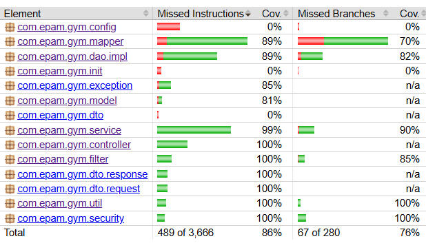

# Gym CRM (Spring Core)

A simple in-memory Gym CRM system built with **Spring Core** (no Spring Boot).
Manages trainees, trainers and trainings with profile creation, username/password
generation

# TODO: 
replace long parameter lists in service methods (create/update)
with request DTOs — planned for the REST module.

## Tech Stack

- Java 17
- Spring Core 6 (MVC, ORM, Security Crypto)
- Lombok
- Hibernate 6 / JPA
- PostgreSQL 16 + HikariCP
- SLF4J + Logback
- MapStruct 1.5.5 (DTO <-> Entity mapping)
- Embedded Apache Tomcat 10
- Swagger / OpenAPI (springdoc)
- JUnit 5, Mockito, AssertJ
- Maven
- JaCoCo (code coverage)

## Prerequisites

- JDK 17+
- Maven 3.9+
- Docker & Docker Compose (for PostgreSQL)
- 
### Key components

| Layer | Responsibility |
|-------|----------------|
| **Facade** | Single entry point aggregating all services |
| **Service** | Business logic (CRUD, username/password generation) |
| **DAO** | In-memory persistence using `Map<Long, Entity>` |
| **Util** | `UsernameGenerator`, `PasswordGenerator` |
| **Init** | `StorageInitBeanPostProcessor` loads CSV data into storage |

## Domain Model

- **User** (base) → `Trainee`, `Trainer`
- **Trainee**: dateOfBirth, address
- **Trainer**: specialization (`TrainingType`)
- **Training**: links a trainee and trainer
- **TrainingType**: enum-backed (`FITNESS`, `YOGA`, `STRENGTH`, ...)

## Features

- Create / update / delete / select **Trainee**
- Create / update / select **Trainer**
- Create / select **Training**
- Automatic **username** generation (`FirstName.LastName`, with serial suffix on collision)
- Automatic random **password** generation (10 chars)
- CSV-based data loading on startup
- Passwords are masked in logs

## Configuration

File paths are defined in `src/main/resources/application.properties`:

```properties
storage.trainee.file=data/trainees.csv
storage.trainer.file=data/trainers.csv
storage.training.file=data/trainings.csv
```

## Build & Run
Build the project:

```bash
mvn clean install
```
Run the demo (App.java):

```bash
mvn exec:java -Dexec.mainClass="com.epam.gym.App"
```
Or run App.main() from IDE.
The application starts an embedded Tomcat on:
```bash
http://localhost:8080
```
Swagger UI:

```bash
http://localhost:8080/swagger-ui/index.html
```
### Tests
Run all unit tests:

```bash
mvn test
```
### Tests coverage


